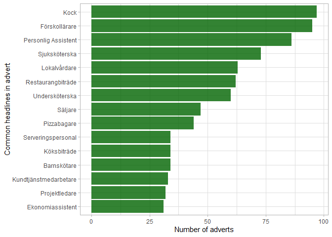
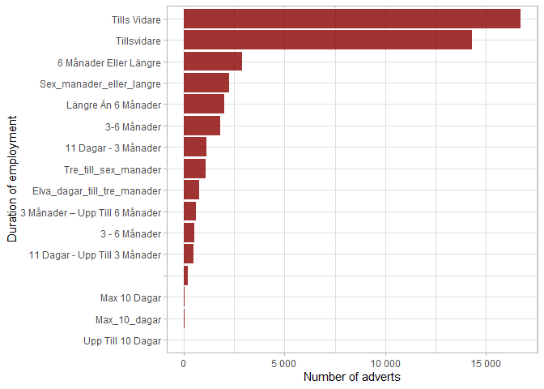
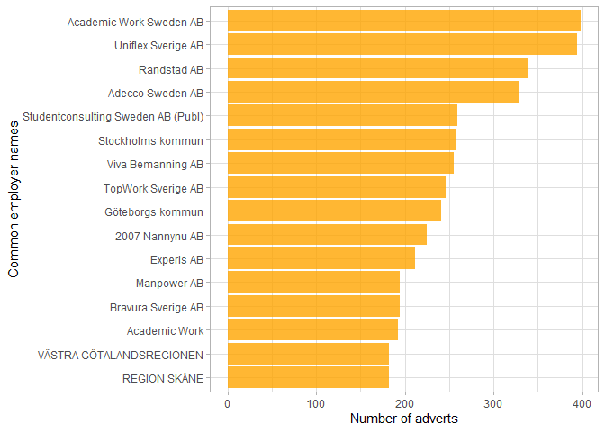
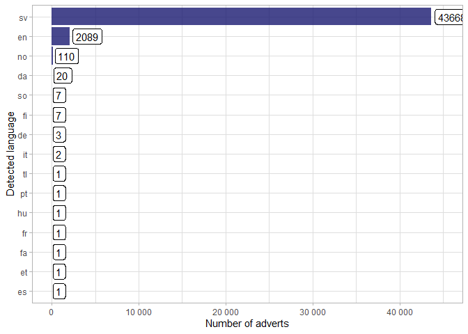

README
================

## Purpose

This repo contains a one percent sample of the enriched jobtech data
from [jobtechdev.se](https://jobtechdev.se/sv).

They provide a one percent sample from 2016 to 2022Q2 to help you get to
grips with the data.

I have ingested this from the seven `.jsonl` files and saved it as two
`.csv` files (because they would be more than 100MB together).

You can download the first and second files from the table below.

<table style="font-family: -apple-system, BlinkMacSystemFont, 'Segoe UI', Roboto, Oxygen, Ubuntu, Cantarell, 'Helvetica Neue', 'Fira Sans', 'Droid Sans', Arial, sans-serif; display: table; border-collapse: collapse; margin-left: auto; margin-right: auto; color: #333333; font-size: 16px; font-weight: normal; font-style: normal; background-color: #FFFFFF; width: auto; border-top-style: solid; border-top-width: 2px; border-top-color: #A8A8A8; border-right-style: none; border-right-width: 2px; border-right-color: #D3D3D3; border-bottom-style: solid; border-bottom-width: 2px; border-bottom-color: #A8A8A8; border-left-style: none; border-left-width: 2px; border-left-color: #D3D3D3;">
  <thead style="">
    <tr>
      <td colspan="1" style="background-color: #FFFFFF; text-align: center; border-bottom-color: #FFFFFF; border-left-style: none; border-left-width: 1px; border-left-color: #D3D3D3; border-right-style: none; border-right-width: 1px; border-right-color: #D3D3D3; color: #333333; font-size: 125%; font-weight: initial; padding-top: 4px; padding-bottom: 4px; padding-left: 5px; padding-right: 5px; border-bottom-width: 0; border-bottom-style: solid; border-bottom-width: 2px; border-bottom-color: #D3D3D3; font-weight: normal;" style><strong>Download data here</strong></td>
    </tr>
    
  </thead>
  
  <tbody style="border-top-style: solid; border-top-width: 2px; border-top-color: #D3D3D3; border-bottom-style: solid; border-bottom-width: 2px; border-bottom-color: #D3D3D3;">
    <tr><td style="padding-top: 8px; padding-bottom: 8px; padding-left: 5px; padding-right: 5px; margin: 10px; border-top-style: solid; border-top-width: 1px; border-top-color: #D3D3D3; border-left-style: none; border-left-width: 1px; border-left-color: #D3D3D3; border-right-style: none; border-right-width: 1px; border-right-color: #D3D3D3; vertical-align: middle; overflow-x: hidden; text-align: center;">

<a href="data/job_tech_data_pt_1.csv">JobTech data pt 1</a>

</td></tr>
    <tr><td style="padding-top: 8px; padding-bottom: 8px; padding-left: 5px; padding-right: 5px; margin: 10px; border-top-style: solid; border-top-width: 1px; border-top-color: #D3D3D3; border-left-style: none; border-left-width: 1px; border-left-color: #D3D3D3; border-right-style: none; border-right-width: 1px; border-right-color: #D3D3D3; vertical-align: middle; overflow-x: hidden; text-align: center;">

<a href="data/job_tech_data_pt_2.csv">JobTech data pt 2</a>

</td></tr>
  </tbody>
  
  
</table>

## Data description

What information is collected?

There are 46,000 adverts in this one percent sample across seven years
from 2016 to 2022. There are 95 variables, the table below shows their
names.

| Variable                                  | Complete rate | Unique values | True/False counts     |
|:------------------------------------------|--------------:|--------------:|:----------------------|
| Application Contacts                      |          100% |             1 | NA                    |
| Application Deadline                      |           85% |         2 249 | NA                    |
| Detected Language                         |           99% |            15 | NA                    |
| Employment Type Concept Id                |           38% |             6 | NA                    |
| Employment Type Label                     |           69% |            10 | NA                    |
| Employment Type Legacy Ams Taxonomy Id    |           38% |             4 | NA                    |
| External Id                               |           50% |        22 936 | NA                    |
| Headline                                  |          100% |        40 600 | NA                    |
| Id                                        |          100% |        46 129 | NA                    |
| Last Publication Date                     |          100% |         2 537 | NA                    |
| Logo Url                                  |           30% |         3 467 | NA                    |
| Occupation Concept Id                     |           40% |         1 348 | NA                    |
| Occupation Label                          |           40% |         1 348 | NA                    |
| Occupation Legacy Ams Taxonomy Id         |          100% |         1 778 | NA                    |
| Occupation Field Concept Id               |           40% |            21 | NA                    |
| Occupation Field Label                    |           40% |            29 | NA                    |
| Occupation Field Legacy Ams Taxonomy Id   |           40% |            21 | NA                    |
| Occupation Group Concept Id               |           40% |           370 | NA                    |
| Occupation Group Label                    |           40% |           391 | NA                    |
| Occupation Group Legacy Ams Taxonomy Id   |           40% |           370 | NA                    |
| Original Id                               |           84% |        38 927 | NA                    |
| Publication Date                          |          100% |        29 236 | NA                    |
| Salary Description                        |           49% |         1 608 | NA                    |
| Source Type                               |           38% |             3 | NA                    |
| Webpage Url                               |           38% |        17 403 | NA                    |
| Application Details Url                   |           56% |        23 854 | NA                    |
| Description Company Information           |           31% |         1 534 | NA                    |
| Description Conditions                    |           82% |        11 864 | NA                    |
| Description Text                          |          100% |        44 084 | NA                    |
| Duration Concept Id                       |           36% |             5 | NA                    |
| Duration Label                            |           97% |            17 | NA                    |
| Duration Legacy Ams Taxonomy Id           |           36% |             5 | NA                    |
| Employer Name                             |          100% |        13 149 | NA                    |
| Employer Organization Number              |           14% |         2 163 | NA                    |
| Employer Url                              |           22% |         3 142 | NA                    |
| Employer Workplace                        |           69% |        11 694 | NA                    |
| Keywords Extracted Occupation             |          100% |         2 807 | NA                    |
| Keywords Extracted Skill                  |          100% |           642 | NA                    |
| Keywords Extracted Location               |          100% |         2 649 | NA                    |
| Keywords Extracted Employer               |          100% |        15 716 | NA                    |
| Keywords Enriched Occupation              |          100% |           335 | NA                    |
| Keywords Enriched Skill                   |          100% |           438 | NA                    |
| Keywords Enriched Trait                   |          100% |           337 | NA                    |
| Keywords Enriched Location                |          100% |           259 | NA                    |
| Keywords Enriched Compound                |          100% |           468 | NA                    |
| Must Have Languages                       |          100% |            54 | NA                    |
| Must Have Skills                          |          100% |           185 | NA                    |
| Must Have Work Experiences                |          100% |         1 117 | NA                    |
| Nice To Have Languages                    |          100% |           104 | NA                    |
| Nice To Have Skills                       |          100% |           350 | NA                    |
| Nice To Have Work Experiences             |          100% |           442 | NA                    |
| Other Old Legacy Attributes Arbetsdrift   |           31% |             4 | NA                    |
| Other Old Legacy Attributes Tilltrade     |           31% |           435 | NA                    |
| Salary Type Concept Id                    |           38% |             3 | NA                    |
| Salary Type Label                         |           69% |             6 | NA                    |
| Salary Type Legacy Ams Taxonomy Id        |           38% |             3 | NA                    |
| Working Hours Type Concept Id             |           36% |             2 | NA                    |
| Working Hours Type Label                  |           97% |             6 | NA                    |
| Working Hours Type Legacy Ams Taxonomy Id |           36% |             2 | NA                    |
| Workplace Address City                    |           68% |         1 513 | NA                    |
| Workplace Address Coordinates             |          100% |         3 651 | NA                    |
| Workplace Address Country                 |           95% |            55 | NA                    |
| Workplace Address Country Code            |           38% |            21 | NA                    |
| Workplace Address Country Concept Id      |           38% |            21 | NA                    |
| Workplace Address Municipality            |           39% |           290 | NA                    |
| Workplace Address Municipality Code       |           70% |           292 | NA                    |
| Workplace Address Municipality Concept Id |           37% |           290 | NA                    |
| Workplace Address Postcode                |           37% |         4 361 | NA                    |
| Workplace Address Region                  |           39% |            22 | NA                    |
| Workplace Address Region Code             |           39% |            22 | NA                    |
| Workplace Address Region Concept Id       |           37% |            41 | NA                    |
| Workplace Address Street Address          |           35% |         7 016 | NA                    |
| Must Have Education                       |          100% |            16 | NA                    |
| Must Have Education Level                 |          100% |             5 | NA                    |
| Nice To Have Education                    |          100% |            15 | NA                    |
| Nice To Have Education Level              |          100% |             6 | NA                    |
| Access To Own Car                         |           38% |            NA | FAL: 16571, TRU: 911  |
| Driving License Required                  |           38% |            NA | FAL: 13781, TRU: 3701 |
| Employment Type Original Value            |          100% |            NA | TRU: 46214            |
| Experience Required                       |           38% |            NA | TRU: 12978, FAL: 4504 |
| Franchise                                 |          100% |            NA | FAL: 46211, TRU: 3    |
| Hire Work Place                           |          100% |            NA | FAL: 46214            |
| Larling                                   |          100% |            NA | FAL: 46213, TRU: 1    |
| Occupation Original Value                 |          100% |            NA | TRU: 46214            |
| Open For All                              |          100% |            NA | FAL: 46214            |
| Remote Work                               |          100% |            NA | FAL: 46148, TRU: 66   |
| Removed                                   |           38% |            NA | FAL: 17482            |
| Trainee                                   |          100% |            NA | FAL: 46210, TRU: 4    |
| Application Details Via Af                |           38% |            NA | FAL: 17482            |
| Rn                                        |          100% |            NA | NA                    |
| Number Of Vacancies                       |          100% |            NA | NA                    |
| Timestamp                                 |           38% |            NA | NA                    |
| Scope Of Work Max                         |           36% |            NA | NA                    |
| Scope Of Work Min                         |           37% |            NA | NA                    |
| Year                                      |          100% |            NA | NA                    |

Variable descriptives

## EDA

### Common titles

### Duration of employment

We would need to do some data cleaning here.

### Common employers

### Langauges

There is column for the language detected in the advert text.

